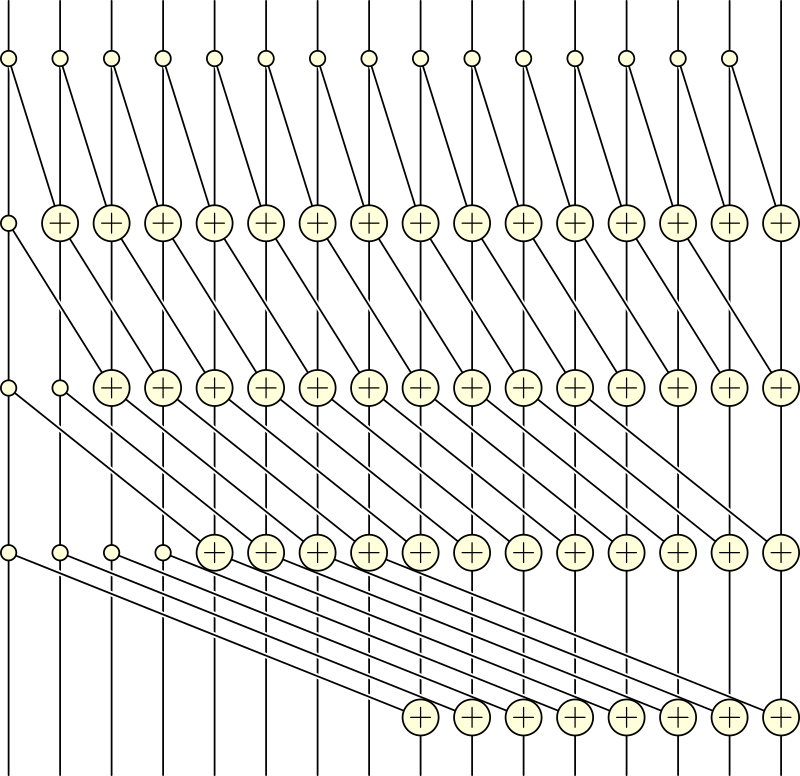

```{r echo=F}
# Initialisation de l'environnement
rm(list=ls())
```

# Prefix scan

## Algorithm 

Input : $x_{0}, x_{1},...,x_{n-1}$

Output : $s_{0}, s_{1},...,s_{n-1}$

Operator: $\otimes$

Prefix scan general formulation:
$$\begin{array}{c}
  s_{0} = x_{0},\\
  s_{1} = x_{0} \otimes x_{1},\\
  s_{2} = x_{0} \otimes x_{1} \otimes x_{2},\\
  ...,\\
  s_{n-1} = x_{0} \otimes x_{1} \otimes ... \otimes x_{n-1}\\ \end{array}$$
  
***

### Simple example with cumsum

```{r}
x <- c(12, 5, 13)
cumsum(x)
```

## Inclusive vs. Exclusive scan

In inclusive scan, $x_{i}$ is included in $s_{i}$. In exclusive prefix scan, $x_{i}$ is not included.

<!--
COMMENTAIRE
\begin{table}[]
\centering
\begin{tabular}{|l|l|}
\hline
Inclusive scan & Exclusive scan \\ \hline
$s_{0} = x_{0}$ & $s_{0} = 0$\\
$s_{1} = x_{0} \otimes x_{1}$ & $s_{1} = x_{0}$\\
$...$ & $...$\\
$x_{n-1} = x_{0} \otimes x_{1} \otimes ... \otimes x_{n-1}$ & $ x_{n-1} = x_{0} \otimes x_{1} \otimes ... \otimes x_{n-2}$\\ \hline
\end{tabular}
\end{table}

-->

### Examples with cumsum

```{r echo=F}
cumsum_inclusive <- function(x) {
  res <- c(x[1])
  temp <- 0
  for (i in 2:length(x)) {
    last_result <- temp
    temp <- x[i] + res[i-1]
    res <- c(res, temp)
  }
  return(res)
}

cumsum_exclusive <- function(x) {
  res <- c(0)
  temp <- 0
  for (i in 1:length(x)-1) {
    last_result <- temp
    temp <- res[i] + x[i]
    res <- c(res, temp)
  }
  return(res)
}
```

```{r}
x <- c(12, 5, 13)
cumsum_inclusive(x)
```

```{r}
x <- c(12, 5, 13)
cumsum_exclusive(x)
```

# Applications

## Polynomial calculation

$$P = 7 + 5x - 3x^2 - 6x^3 + 3x^4$$

#### Exclusive prefix scan with product operator 

$$ \begin{array}{cccccc}
  x & x & x & x & x\\
  s_{0} = x^0 & s_{1}=x^1 & s_{2}=x^2 & s_{3}=x^3 & s_{4}=x^4\end{array}$$

#### Multiplication of the input vectors and the coefficient vectors

$$ \begin{array}{cccccc}
  x^0 & x^1 & x^2 & x^3 & x^4\\
  * & * & * & * & *\\
  7 & 5 & -3 & -6 & 3\end{array}$$
  
***

## Calculation of polynomial

$$ x=7 $$
$$P = 7 + 5x - 3x^2 - 6x^3 + 3x^4$$

```{r echo=F}
x <- c(rep(7, 4))
xprod <- c(1,cumprod(x))
coef <- c(7, 5, -3, -6, 3)
res <- xprod * coef
```

```{r}
x
c(1,cumprod(x))
coef
```

## Calculation of polynomial

```{r}
res
sum(res)
```

# Parallelization methods

## Algorithm

### log-based method

```{r eval=F}
for i <- 0 to [log_2 n] - 1 do
  for j <- 0 do n - 1 do in parallel
    if j < 2^i then
      x^(i+1)_{j} <- x^i_j
    else
      x^(i+1)_{j} <- x^i_j + x^i_(j-2^i)
```

## Illustration

### Illustration

{width=200px}

<!--
- 
- Hillis and Steele
1980

- Blelloch 
a work-efficient data-parallel algorithm
1990

- Brent-Kung

- Kogge-Stone

- Sklansky

- Han-Carlson

- Daniel Horn (2005)

3 algorithms:

- bottom-up

- top-down

Work-efficiency :

An algorithm is considered to be work-efficient if its work complexity scales linearly with the size of input data.
-->

# Benchmark

## Functions implemented

- cs : sequential cumsum
- vcs : vectorized cumsum
- scs : "sapply" cumsum
- pscs : parallel "sapply" cumsum
- fcs : "foreach" cumsum
- pfcs : parallel "foreach" cumsum
- c-cs : compiled cs
- c-scs : compiled scs
- c-vcs : compiled vcs

## Benchmark

```{r}

```

## Cumsum comparisons

```{r, echo=F, warning=F}
test <- runif(1e2)
bench <- microbenchmark::microbenchmark(cumsum_inclusive(test),
                               cumsum_exclusive(test),
                               cumsum(test))
ggplot2::autoplot(bench)
```

---